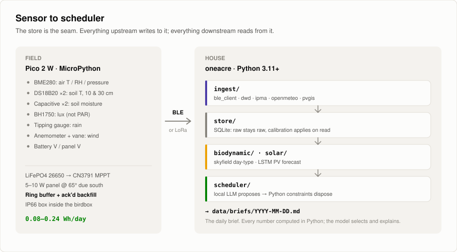
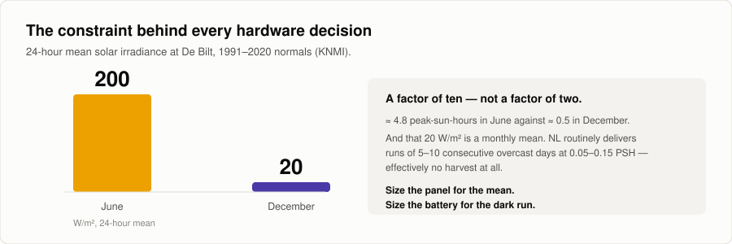
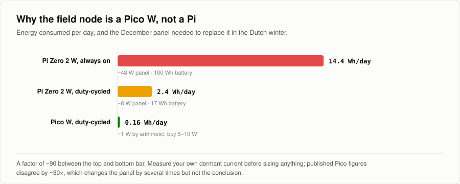
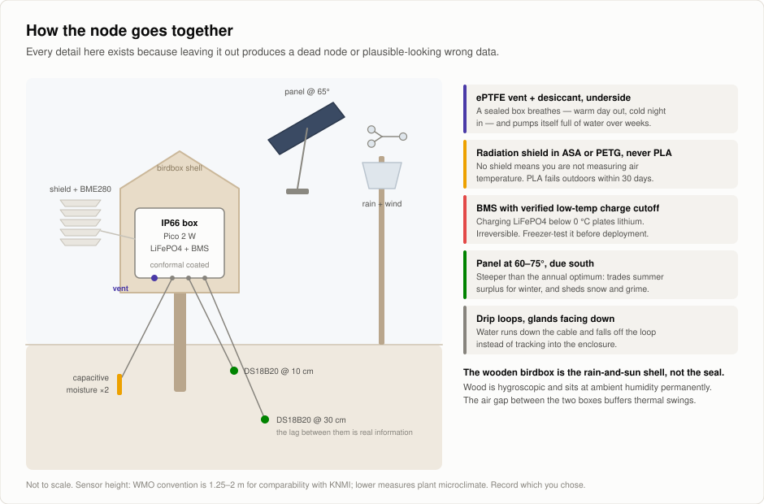
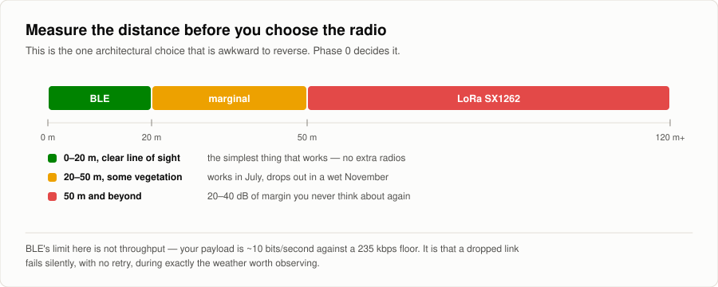
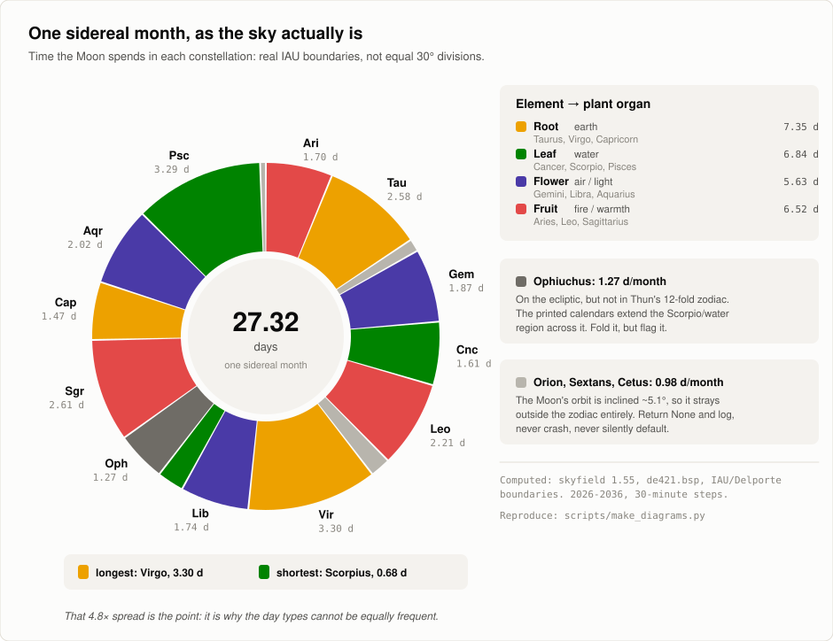
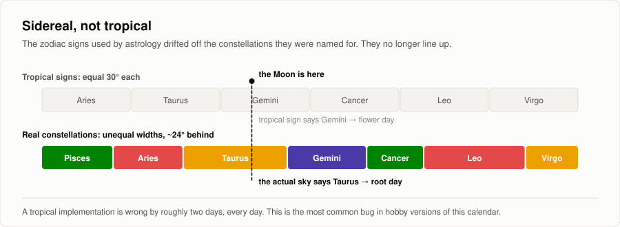
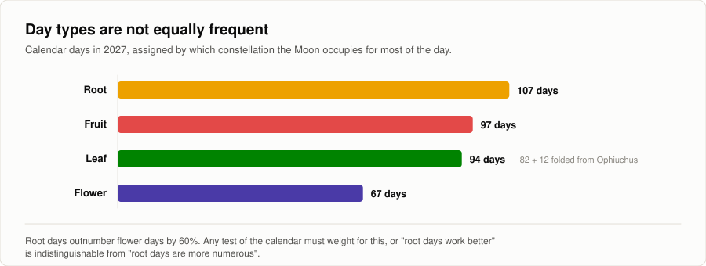
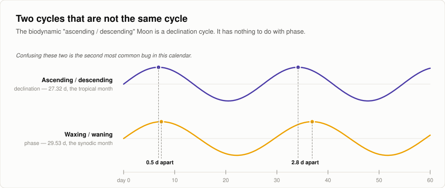
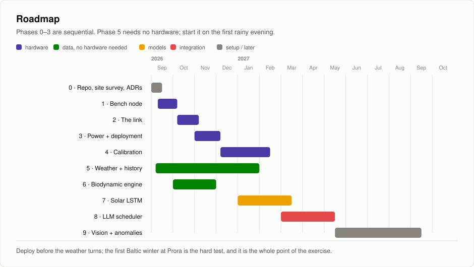

# One Acre, Zero Dependency

Off-grid, AI-driven farming on two seasonal plots near Utrecht (NL), one cultivated through summer,
the other through winter. A solar-powered field node measures soil and weather; a laptop-side Python
stack merges that with 125 years of public Dutch weather records, forecasts its own solar budget,
computes the Thun biodynamic day-type from first principles, and asks a **local** LLM to turn all of
it into a daily plan.

> **How much of a small farm's daily decision-making can genuinely off-grid AI handle end to end,
> from sensor to scheduler?**

Project write-up: **[meihuizen.ai/projects/off-grid-ai-homestead](https://www.meihuizen.ai/projects/off-grid-ai-homestead.html)**
· Step-by-step plan: **[`docs/BUILD_PLAN.md`](docs/BUILD_PLAN.md)**
· Status: **Phase 0**: nothing is built yet, the plan is.



---

## Three commitments

**1. Off-grid means off-grid.** No cloud LLM in the daily loop. The scheduler runs on the laptop
against a local model. Network is used to *pull public historical data* during setup and for
occasional refreshes, never as a runtime dependency of a decision.

**2. Every number carries its provenance and its error bar.** A €30 sensor that claims ±0.3 pH does
not get to state pH to one decimal. See [What the hardware can honestly measure](#what-the-hardware-can-honestly-measure).

**3. The biodynamic calendar is a hypothesis under test, not a scheduling rule.** The evidence does
not support the trigon effect. This project computes it correctly, logs it as a covariate, and tests
it honestly against a pre-registered analysis. A null result is a valid output, possibly the most
valuable one. See [The Thun calendar](#the-thun-calendar-done-honestly).

---

## Contents

- [The field node](#the-field-node): [why a Pico](#why-the-node-is-a-pico-w-not-a-raspberry-pi) · [BOM](#bill-of-materials) · [sensor honesty](#what-the-hardware-can-honestly-measure) · [how it goes together](#how-the-node-goes-together) · [the link](#the-link-measure-before-you-choose)
- [The AI side](#the-ai-side): [weather data](#weather-and-history) · [the Thun calendar](#the-thun-calendar-done-honestly) · [solar forecast](#solar-forecast) · [the scheduler](#the-llm-scheduler)
- [Repository layout](#repository-layout)
- [Build phases](#build-phases) · [Milestones](#milestones) · [Risks](#risks)
- [Getting started](#getting-started)

---

# The field node

## Why the node is a Pico W, not a Raspberry Pi

The project brief said "Raspberry Pi". The Dutch winter says otherwise.



A Pi Zero 2 W idles at 0.4–0.6 W; even halted it draws ~50 mA. At 0.5 December peak-sun-hours that
means roughly a 60 W panel and 100 Wh of battery, a caravan installation bolted to a birdbox.



A Pico 2 W also has a mechanical advantage that matters more than the MCU itself: **VSYS accepts
1.8–5.5 V**, so a single LiFePO4 cell drives it directly, no boost stage, and therefore no
boost-converter quiescent current. A Pi still has a place in this project; it just isn't in the
field box.

> **The shopping trap:** a charge controller's own quiescent current can exceed a well-designed
> node's entire consumption. The Waveshare Solar Power Manager (D) draws **<30 mA quiescent =
> 3.6 Wh/day**, which is 15–45× a Pico node's whole budget. **Pick the power path before you pick
> the MCU.**

## Bill of materials

~€175 ex VAT, or ~€100 without the weather meters. Kiwi Electronics lists **ex 21% VAT**;
Tinytronics incl. Prices captured Aug 2026; verify at checkout.

| Item | Source | € ex VAT | Notes |
|---|---|---|---|
| Raspberry Pi Pico 2 W (with header) | Kiwi | 7.19 | VSYS 1.8–5.5 V → LiFePO4 direct |
| BME280 air T / RH / pressure | Tinytronics | ~6 | forced mode only |
| DS18B20 waterproof ×2 (1 m + 2 m) | Tinytronics | ~12 | 10 cm + 30 cm depth |
| Capacitive soil moisture ×2 | Tinytronics | 8 | epoxy-pot them; buy spares |
| BH1750 lux | Tinytronics | ~5 | call it lux, **not** PAR, in the schema |
| SparkFun Weather Meters SEN-15901 | Kiwi | 72.99 | rain + anemometer + vane, passive reeds |
| LiFePO4 26650 4500 mAh + 1S BMS | NKON (Arnhem) | ~5 | **BMS must have low-temp charge cutoff** |
| CN3791 MPPT charger, LiFePO4 config | AliExpress | ~4 | µA-class quiescent; order this first, it ships slowest |
| Solar panel 5–10 W ETFE | Kiwi | ~35 | or a generic 20 W 12 V glass panel, €25–45 |
| IP66 ABS box + Gore vent + desiccant + glands | generic | ~15 | goes *inside* the birdbox |
| ASA/PETG radiation shield | self-printed | ~3 | [Printables #73421](https://www.printables.com/model/73421-radiation-shields-for-diy-weather-station) |
| **Total** | | **~173** | |

**Optional:** a 7-in-1 RS485 soil probe (~€30) + MAX3485 + 12 V boost; buy it only for its
moisture, temperature and **EC** channels, and power-gate it (0.15 W would otherwise dominate the
node). A LoRa SX1262 pair (~€20) if the site survey measures more than ~50 m.

## What the hardware can honestly measure

Read this before buying anything. Three of the sensors people reflexively buy for this project do
not measure what their product page says.

### The NPK channels are fabricated

The cheap 7-in-1 RS485 soil probes report N, P and K in mg/kg. A sensor vendor states plainly in
their own product literature that the device measures bulk electrical conductivity and multiplies it
by three fixed constants:

> "the soil NPK sensor actually measures the electrical conductivity of the soil… such sensors
> cannot accurately measure the actual nitrogen, phosphorus and potassium content of the soil on
> site, but give an empirical, theoretical value."
> Source: [Niubol](https://www.niubol.com/Product-knowledge/Soil-NPK-Sensors-Principle.html)

So N, P and K are three scaled copies of one number and move together. Add urea and watch phosphorus
"rise". **Buy the probe for its moisture, temperature and EC channels (those are real, and EC is
genuinely useful), and never make a fertiliser decision from the N/P/K registers.** For actual
fertility, send soil to a lab (Eurofins Agro, Wageningen) once or twice a year. That costs about what
the sensor costs and produces numbers that mean something.

### Continuous in-soil pH is not achievable at this budget

Readings rise by **~1.5 pH units** as the same soil goes from dry to field capacity, the relationship
is soil-type dependent (linear in sand, exponential in clay), and below ~11% moisture readings become
unreliable ([Vasques et al., *SOIL* 10:321, 2024](https://soil.copernicus.org/articles/10/321/2024/)).
A real lab-grade probe is ~€100 with a ~2.5-year life plus a ~€65 high-impedance carrier board, and
it needs its glass bulb kept permanently hydrated, which a July soil will not do.

**Do pH the boring way:** a sample indoors, 1:5 soil:CaCl₂, calibrated €50 bench meter, twice a year.
NL soil pH does not move on a daily timescale, so continuous logging has almost no information value
anyway.

### Capacitive soil moisture is a relative index, not %VWC

Expect fewer than 400 raw counts across the entire dry→saturated span; the ADC is not the limit, the
analog front end is, so a 16-bit external converter would not help. Add strong temperature
cross-sensitivity, an onboard regulator that goes out of spec below ~3.4 V (exactly where LiFePO4
lives), and an ink mask that fails within a year unless epoxy-potted
([Cave Pearl Project](https://thecavepearlproject.org/2020/10/27/hacking-a-capacitive-soil-moisture-sensor-for-frequency-output/)).
**Log soil temperature next to every moisture probe and regress it out.**

### The two that are unambiguously good

- **DS18B20 waterproof soil temperature**, ±0.5 °C, €4–9. Bury two (10 cm and 30 cm); the phase lag
  between them is genuinely informative and costs €6. Use a 4.7 kΩ pull-up and **avoid parasite power
  on long cables**; that is the single most common cause of flaky 1-Wire in a field.
- **SparkFun/Argent weather meters** (rain + anemometer + vane). All three are passive reed switches,
  zero standby current, exactly right for solar. **Debounce the rain reed in software** or you will
  silently inflate rainfall totals by 10–30%.

### Two configuration traps that produce plausible-looking wrong data

- **BME280 self-heating.** Continuous mode with high oversampling biases its own temperature reading
  **+1 to +2 °C**. Use forced mode, 1× oversampling, one reading per ≥60 s, sleep between, which is
  what the power budget wants anyway.
- **No radiation shield means you are not measuring air temperature.** An unshielded sensor in sun
  errs by up to ~3 °C, and inadequate airflow *compresses the diurnal range*, underestimating maxima
  and overestimating minima, which looks plausible and is therefore worse than a constant offset.

## How the node goes together



Two failure modes will kill the node before any sensor does:

**Condensation.** A sealed box breathes: it warms in the day and pushes air out, cools at night and
sucks damp air in through every imperfection, and over weeks it pumps itself full of water. **A
tighter seal makes this worse.** In the Dutch climate this is a certainty, not a risk. Fit a
**Gore-type ePTFE pressure-equalisation vent** (~€3, the highest-value three euros in the build), add
indicating desiccant, conformal-coat the boards, put every gland and the vent on the *underside*, and
drip-loop every cable.

**Cold charging.** **Never charge LiFePO4 below 0 °C.** Lithium plates on the anode: 1–5% permanent
capacity loss per event, irreversible, dendrite risk. Many cheap 1S BMS boards **do not implement
low-temperature charge cutoff**: verify the datasheet or add an NTC + MOSFET yourself, and test it in
a freezer. NL frost mornings are also the clear-sky sunny ones, so the correlation works against you.
Bury or insulate the cell; soil at 30 cm barely drops below 3–4 °C.

Print the radiation shield in **ASA or PETG, not PLA**. PLA loses notable strength outdoors within 30
days. Use the wooden birdbox as the decorative rain-and-sun shell and put a proper IP66 box **inside**
it; the air gap between them buffers thermal swings nicely.

## The link: measure before you choose



BLE's limit here is not throughput; the payload is ~10 bits/second against a 235 kbps floor. It is
that a dropped connection **fails silently, with no retry**, so you lose data during exactly the
weather events the station was built to observe. Keep BLE as the walk-up service interface regardless
of what carries telemetry; that role it does excellently and it is nearly free.

`ingest/` is the seam: swapping BLE for LoRa touches one module and nothing downstream. That is the
whole reason for the layering.

---

# The AI side

## Weather and history

| Source | What for | Access |
|---|---|---|
| **KNMI script service** | De Bilt **station 260**, ~6 km NE of Utrecht. **Daily series from 1901-01-01.** Ground truth. Includes `Q` (global radiation) and `EV24` (Makkink reference ET). | `daggegevens.knmi.nl/klimatologie/daggegevens?stns=260&vars=ALL&…`, **no API key** |
| **Open-Meteo archive** | ERA5-Land 0.1° (~11 km), **1950→present**, 5-day latency. Soil moisture and temperature at depth, `et0_fao_evapotranspiration`, VPD: the things a weather station cannot measure. | `archive-api.open-meteo.com/v1/archive?…&models=era5_land` |
| **Open-Meteo forecast** | **KNMI Harmonie AROME at 2 km, hourly updates**, KNMI's own operational high-res model. Best available for a Utrecht plot. | `api.open-meteo.com/v1/forecast?…&models=knmi_harmonie_arome_netherlands` |
| **Open-Meteo satellite** | Satellite-*observed* irradiance (SARAH3, 5 km, 1983→). Computes **plane-of-array irradiance** from `tilt`+`azimuth`, removing a whole transposition step from the PV model. | `satellite-api.open-meteo.com/v1/archive?…&tilt=65&azimuth=0` |
| **PVGIS (EU JRC)** | One-off system sizing and optimum tilt for the exact coordinates. Design tool, not a forecasting tool. | `re.jrc.ec.europa.eu/api/v5_3/PVcalc?…&optimalangles=1` |

**Four traps, all of which produce silently wrong data:**

- KNMI values are **integer-scaled**: temperatures in 0.1 °C, rain in 0.1 mm, radiation in J/cm²
  (×2.778 for Wh/m²). `-1` in RH/SQ means "<0.05", not minus one.
- **KNMI `EV24` is Makkink; Open-Meteo `et0_fao_evapotranspiration` is FAO-56 Penman-Monteith.** They
  will not agree. Never mix them in one series.
- **Open-Meteo's archive and forecast use different soil depth bins** (archive 0–7/7–28/28–100 cm;
  forecast 0/6/18/54 cm). You cannot concatenate them without an explicit mapping step.
- KNMI states its station series are **unsuitable for trend analysis** (relocations, instrument
  changes). Fine operationally, wrong for climate trending.

Full detail in [`docs/DATA_SOURCES.md`](docs/DATA_SOURCES.md). Open-Meteo is CC-BY-4.0; attribute it.

## The Thun calendar, done honestly

### It isn't Steiner's calendar

Steiner's *Agriculture Course* (GA 327, eight lectures at Koberwitz, June 1924) contains the
farm-as-organism concept and the numbered preparations. It contains **no root/leaf/flower/fruit scheme
and no constellation-to-organ mapping.** The lineage is:

**Steiner 1924** (cosmic-forces doctrine, no calendar) → **Franz Rulni 1948–1979** (hand-distributed
constellation seed calendar) → **Maria Thun, first published 1963** (the system everyone actually
means; the 2026 edition is the 64th, which confirms the start year).

Thun's radish trials began as an attempt to *test* Rulni's claims. Say **"Thun calendar"** in the code
and the docs; the project loses credibility on the first sentence otherwise.

### The mapping, and why it is a real computation



Every figure above was computed from the ephemeris (skyfield + de421, IAU/Delporte boundaries,
2026–2036 at 30-minute steps) rather than taken from secondhand sources, and doing so corrected one
widely repeated claim. The commonly quoted "Libra is as short as 18°" is **wrong**: Scorpius is the
short one, at 0.68 days against Virgo's 3.30. Reproduce it with
[`scripts/thun_reference.py`](scripts/thun_reference.py); reference values live in
[`data/fixtures/expected_daytype_frequencies.json`](data/fixtures/expected_daytype_frequencies.json).

**1 · Sidereal, not tropical.** The calendar tracks the Moon against the actual star constellations.
Tropical astrological signs are currently offset ~24–25°, roughly a whole sign.



**2 · Real IAU boundaries, unequal in length**, so the day types are structurally unbalanced.



**3 · Ascending/descending is declination, not phase.** A ~27.3-day cycle of lunar declination,
completely independent of the 29.53-day waxing/waning cycle. Confusing the two is the second most
common bug in hobby implementations.



**4 · Blanking rules.** Node crossings (both), eclipses and, in the Thun tradition, perigee are
marked unfavourable, with a window of hours either side.

### Implementation notes

Skyfield (MIT) with JPL `de440s.bsp`, **not** Swiss Ephemeris, which is dual-licensed
AGPL/commercial. Pin the kernel locally; this is an off-grid project and a runtime download is not a
dependency you want.

- `load_constellation_map()` handles the **B1875 precession internally**; you do not.
- **`find_maxima` / `find_minima` are in `skyfield.searchlib`, not `skyfield.almanac`**; many online
  examples get this wrong. Use them over apparent lunar declination (`rough_period≈27.3`) for
  ascending/descending, and over Earth–Moon distance (`rough_period≈27.55`, the *anomalistic* month,
  a different constant) for perigee/apogee.
- **Trines are not provided**: compute from geocentric ecliptic longitude differences ≈120°±orb.

**Two gotchas that only appear in a correct implementation.** *Ophiuchus:* real IAU boundaries put a
slice of the ecliptic in Ophiuchus and the Moon spends ~1.27 days per sidereal month there, but Thun's
zodiac is 12-fold. Fold it into water/leaf, but **flag it in the output**, and verify against a
printed edition; Thun's exact handling isn't documented anywhere findable. *Non-zodiacal strays:* the
Moon's orbit is inclined ~5.1°, so it spends ~0.98 days per month in Orion, Sextans, Cetus, Auriga and
even Corvus. Return `None` with a log line; never crash, never silently default.

### Validation

There is **no open, licensed dataset of Thun calendar days.** Published editions are copyrighted
compilations and, in the EU, additionally protected by the sui generis database right (Dir. 96/9/EC).
The *dates* are astronomical facts and we compute them ourselves.

Buy one printed edition (~€10), hand-key 60–90 days spanning two sidereal months into
`data/fixtures/thun_validation.json`, and **keep that file out of the repo**; `.gitignore` already
excludes it. Expect disagreements to cluster on exactly three things: the Ophiuchus fold-in, the
node-blanking window width, and transition times of day. **If your mismatches are scattered rather
than clustered on those three, you have a real bug**, almost certainly tropical-vs-sidereal.

### The evidence, stated plainly

The specific claim (that the Moon's position against a constellation at sowing measurably changes
yield in the corresponding plant organ) is **not supported**.

- **Hartmut Spiess (1990)**, working *inside* the biodynamic tradition at the Institute for Biodynamic
  Research, ran systematic radish trials 1977–1986. He found modest synodic effects but **failed to
  verify Thun's trigon effect**, precisely the constellation mechanism.
- **Mayoral et al. (2020)**, *Agronomy* 10(7):955: *"there is no reliable, science-based evidence for
  any relationship between lunar phases and plant physiology."* The physics is also unkind: lunar
  tidal force on a 2 m organism is ~1000× smaller than that of a 1 kg mass at 1 m.
- The one favourable review, **Kollerstrom & Staudenmaier (2001)**, is a contested reanalysis of
  Spiess's own data by a non-neutral author.
- Separately and honestly: there **is** credible plant science on **moonlight as a weak photoperiodic
  cue**. That is evidence about photons, not constellations. **Do not let the first launder the
  second.**

So the calendar is a **logged covariate, never a hard constraint**. The scheduler may surface "today
is a leaf day" as context; every planting records its day-type; and over seasons it gets tested, from
an unusually good position, because the weather pipeline supplies exactly the covariates the
historical trials lacked. Pre-registration: [`docs/PREREGISTRATION.md`](docs/PREREGISTRATION.md),
frozen **before** the first sowing.

## Solar forecast

Predict tomorrow's harvestable energy and the resulting battery state, so power-hungry work gets
scheduled into the sun.

**Start with baselines you must beat**: persistence ("tomorrow = today") and a clear-sky-index model.
Report all skill *relative to these*. An LSTM that cannot beat persistence is a finding, and an honest
one. **Walk-forward validation only**: a random split on a time series leaks the future and produces
flattering nonsense.

**The honest constraint:** you will have one winter of data. An LSTM on ~90 days of a strongly
seasonal signal will overfit. Either pre-train on satellite/PVGIS-reconstructed history at your
coordinates and fine-tune locally, or accept that a physical model plus a small residual regressor
beats a data-hungry network here, and log that as the result. **Do not report a deep model as better
than it is because it was more fun to build.**

## The LLM scheduler

A local model (Ollama, Qwen/Llama-class instruct) sized to the laptop. Keeps the off-grid claim honest
and costs nothing per call.

**The LLM never computes.** Every number (degree-days, soil moisture deficit, frost risk, day-type,
PV budget) is computed in tested Python and passed in as a structured context block. The model's only
jobs are *selection*, *prioritisation* and *explanation*. An LLM asked to do arithmetic on sensor data
will produce confident, plausible, wrong numbers.

Output is **schema-validated JSON**: `{action, crop, plot, window, rationale, confidence,
inputs_used}`. `inputs_used` is what makes a recommendation auditable three months later. A
**deterministic constraint layer runs after the model** (frost tonight, soil too wet to work, water
budget, bed already planted) and can veto or defer. The LLM proposes; Python disposes.

Prompts live in `scheduler/prompts/` and every output records the prompt hash, so when the advice
changes you know whether the world changed or the prompt did.

The daily brief lands in `data/briefs/YYYY-MM-DD.md`. And when you disagree with a recommendation,
write down why in [`docs/DISAGREEMENTS.md`](docs/DISAGREEMENTS.md); **that file is the actual research
output of this project.**

---

# Repository layout

```
one-acre/
│
├── README.md                       ← you are here
├── LICENSE                         MIT (code)
├── pyproject.toml                  package + deps + ruff/pytest config
├── .github/workflows/ci.yml        ruff + pytest on every push
│
├── docs/
│   ├── BUILD_PLAN.md               the step-by-step plan: phases, done-when criteria
│   ├── DECISIONS.md                ADRs 0001–0005 (0004 is still open: the radio)
│   ├── SITE.md                     ⚠ fill in Phase 0: coordinates, siting, LINK DISTANCE
│   ├── DATA_SOURCES.md             KNMI / Open-Meteo / PVGIS endpoints, units, traps
│   ├── POWER_BUDGET.md             ⚠ measure dormant current, then size panel + battery
│   ├── UNCERTAINTY.md              what each channel is actually worth, per sensor
│   ├── PREREGISTRATION.md          ⚠ freeze BEFORE the first sowing
│   ├── DISAGREEMENTS.md            where you overrode the scheduler, and what happened
│   └── img/                        generated SVG figures; see scripts/make_diagrams.py
│
├── node/                           MicroPython, runs on the Pico 2 W
│   ├── main.py                     read → buffer → advertise → sleep
│   ├── sensors/                    ds18b20 · bme280 · bh1750 · soil_moisture · rain_wind
│   │                               contract: read() -> dict, units in the key names,
│   │                               raw counts stay raw
│   ├── link/
│   │   ├── packet.py               wire format: versioned schema, sequence numbers
│   │   ├── ble_peripheral.py       Nordic UART Service via aioble
│   │   └── buffer.py               flash ring buffer + acknowledged backfill
│   └── power/duty_cycle.py         wake → read → advertise → sleep
│
├── src/oneacre/                    the laptop package
│   ├── config.py                   site constants: lat/lon, station, panel geometry
│   ├── cli.py                      `oneacre ingest|weather|biodynamic|solar|brief`
│   ├── ingest/
│   │   ├── ble_client.py           bleak central (laptop) ← node peripheral
│   │   ├── lora_client.py          same contract, if ADR-0004 says LoRa
│   │   ├── knmi.py                 De Bilt 260, 1901 → present
│   │   ├── openmeteo.py            ERA5-Land archive · Harmonie AROME · satellite GTI
│   │   └── pvgis.py                one-off system sizing
│   ├── store/
│   │   ├── schema.sql              readings · weather · daytypes · plantings
│   │   └── db.py                   raw stays raw; calibration applies on read
│   ├── biodynamic/
│   │   ├── constellations.py       element → organ map, Ophiuchus + stray handling
│   │   ├── ephemeris.py            skyfield wrapper; the API gotchas are documented here
│   │   ├── calendar.py             day-type engine
│   │   └── validate.py             check against a purchased printed edition
│   ├── solar/                      baselines.py (build first) · features.py · lstm.py
│   ├── scheduler/
│   │   ├── context.py              EVERY number computed here, in tested Python
│   │   ├── llm.py                  local model, schema-validated JSON out
│   │   ├── constraints.py          runs AFTER the model; can veto or defer
│   │   └── brief.py                → data/briefs/YYYY-MM-DD.md
│   └── vision/                     Phase 9: inventory counting
│
├── tests/                          test_smoke · test_packet · test_biodynamic
│                                   (the biodynamic tests encode the three likely bugs;
│                                    they are written before the implementation)
├── hardware/                       wiring diagrams, enclosure STLs, panel siting notes
├── scripts/
│   ├── create_issues.sh            creates the 25 milestone issues with `gh`
│   ├── make_diagrams.py            regenerates docs/img/*.svg
│   └── thun_reference.py           reference day-type calculation to check yours against
├── notebooks/                      exploration only; nothing load-bearing lives here
└── data/                           gitignored except fixtures
    ├── raw/  processed/  calibration/  briefs/
    └── fixtures/
        ├── expected_daytype_frequencies.json    computed facts, committed
        └── thun_validation.json                 hand-keyed from a purchased edition,
                                                 GITIGNORED, never redistribute
```

**Two conventions worth holding to.** *Units in every name*: `air_temp_c`, `soil_vwc_frac`,
`rain_mm`, `irradiance_wm2`; half the bugs in a project like this are unit bugs and they are
invisible. *Raw stays raw*: calibration and correction apply on read, never destructively, because
you will improve every curve here and want to reprocess three years of history.

---

# Build phases



Phases 0–3 are sequential. **Phase 5 needs no hardware**: start it on the first rainy evening while
you wait for parcels. Each phase in [`docs/BUILD_PLAN.md`](docs/BUILD_PLAN.md) has a *done-when* you
can actually check; nothing is done because code exists.

| Phase | Done when |
|---|---|
| **0 · Repo, site survey, ADRs** | Repo pushed, ADRs 0001–0004 decided, `docs/SITE.md` has real coordinates **and the measured link distance**, `pytest` exits 0 |
| **1 · Bench node** | A single loop prints a complete plausible reading every 60 s for an hour with no exception, and ten manual bucket tips read **exactly 10** |
| **2 · The link** | Bluetooth off for 20 minutes, back on, and **every** reading from the gap is in the database with correct `measured_at` |
| **3 · Power + deployment** | 14 consecutive days outdoors, no gaps, no intervention, battery recovering on every sunny day, then 14 more spanning a genuinely overcast week |
| **4 · Calibration** | `calibration.apply()` turns a raw row into a physical row, and `docs/UNCERTAINTY.md` states a defensible error bar per channel |
| **5 · Weather + history** | `oneacre weather backfill --from 1990-01-01` produces a continuous series with an explicit gap report, and local readings overlay De Bilt visibly |
| **6 · Biodynamic engine** | Ophiuchus folds *and is flagged*; strays return `None`; validation mismatches cluster on the three known causes |
| **7 · Solar forecast** | Next-24h Wh with a stated interval, and a model card reporting skill against **both** baselines on a walk-forward split |
| **8 · LLM scheduler** | Seven consecutive dated briefs, each traceable to its inputs, and at least one entry in `DISAGREEMENTS.md` |
| **9 · Vision + anomalies** | Item counts from shelf photos. Gated behind a full season of data. |

## Milestones

25 issues, created by [`scripts/create_issues.sh`](scripts/create_issues.sh) once the repo is pushed:
site survey → CI → bench sensors → packet format → BLE peripheral → ingest → ring buffer → dormant
current → power path → deployment → KNMI → Open-Meteo → PVGIS → day-type engine → declination and
blanking → printed-calendar validation → calibration → solar baselines → LSTM → scheduler context →
LLM + constraints → daily briefs → pre-registration → vision spike.

## Risks

| Risk | Likelihood | What it costs | Mitigation |
|---|---|---|---|
| BLE unreliable at the real distance | **High if >30 m** | Silent data loss in bad weather | Measure in Phase 0; the `ingest/` seam makes LoRa a one-module change |
| Condensation kills the node | **Near-certain without a vent** | A dead node in February | ePTFE vent + desiccant + conformal coat + underside glands. €5 total. |
| LiFePO4 charged below 0 °C | Moderate | Permanent, irreversible cell damage | Verify BMS low-temp cutoff **in a freezer** before deployment |
| Data plausible but wrong (self-heating, no shield, reed bounce) | **High: this is the default outcome** | Months of confidently wrong analysis | The four bench tests in Phase 1; cross-check against De Bilt in Phase 4 |
| LSTM overfits one winter | High | An impressive model that forecasts nothing | Baselines first, walk-forward only, pre-train on reconstructed history |
| LLM does arithmetic and gets it wrong | **Certain if allowed** | Confident, plausible, wrong advice | All numbers in Python; the model selects and explains only |
| Biodynamic analysis finds a spurious effect | Moderate | The project's credibility | Pre-register; weight for unequal day-type frequency |
| Scope creep into the vision side | High, it is the fun part | The core loop never closes | Phase 9 is gated behind a full season. Hold the line. |

---

# Getting started

```bash
git clone <this repo> && cd one-acre
uv venv && uv pip install -e ".[dev]"     # or: python -m venv .venv && pip install -e ".[dev]"
pytest                                     # should exit 0
oneacre status
```

**Then, in order:**

1. **Walk the plot-to-laptop distance and write the number in `docs/SITE.md`.** Everything in Phase 2
   depends on it, and ADR-0004 cannot be closed without it.
2. **Order the BOM.** Kiwi + Tinytronics + NKON covers all of it; the CN3791 is the only AliExpress
   item and therefore the long pole; order that first.
3. **Push the repo and create the issues** (`scripts/create_issues.sh`).
4. **Start Phase 5 tonight**: it needs no hardware. The KNMI ingester against station 260 is an
   hour's work and gives you 125 years of De Bilt to look at while you wait for parcels.
5. **Buy one printed Thun calendar** now; you need it in Phase 6 and it ships slowly.

## Regenerating the figures

```bash
python3 scripts/make_diagrams.py     # → docs/img/*.svg, no dependencies
python3 scripts/thun_reference.py    # → the day-type figures (needs skyfield + a kernel)
```

The figures are plain SVG with inline presentation attributes: no `<style>` blocks, no scripts, no
external references, so they survive GitHub's sanitiser, and each paints its own light surface so it
reads on both GitHub themes. The categorical palette (root/leaf/flower/fruit) was validated for
colour-vision deficiency across all pairs; the obvious "earthy" choice fails, because brown and
terracotta are indistinguishable to a deuteranope.

---

## Licence and attribution

MIT for the code. Weather data from **KNMI** (CC0 for the in-situ observation datasets) and
**Open-Meteo** (CC-BY-4.0, attribute it). Ephemerides from **JPL** (public domain) via
**skyfield** (MIT). No copyrighted calendar data is redistributed here, and none should be.
